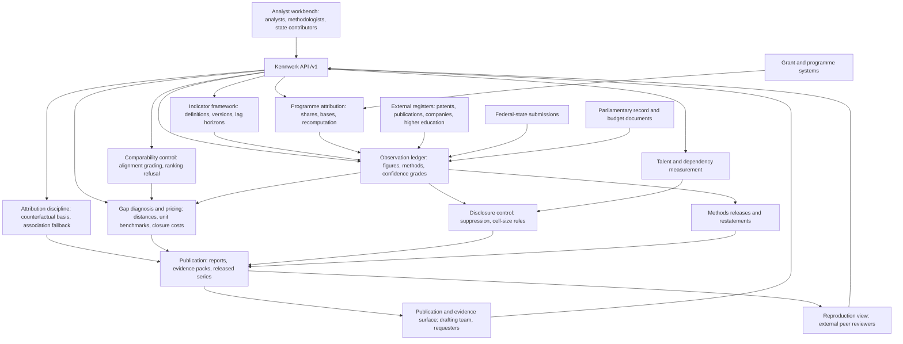

# Kennwerk

**Source:** `ai-in-gov/Outline_for_a_German_Artificial_Intelligence_Strategy/`
**Domain:** `ai-gov`
**One-liner:** Kennwerk is the measurement workbench for national AI capability, where every figure carries its derivation method, its attribution share and a confidence grade — so a government can say how far behind it is, on which building block, priced against a named comparator, without pretending the underlying data exists when it does not.
**Wedge:** The evidence unit behind an expert commission with a statutory annual reporting duty, starting with the single hardest number in the file: how much public money actually goes to AI research, reconstructed from programmes whose funded-topic descriptions do not mention artificial intelligence at all.
**Positioning:** A capability-gap measurement system for national technology strategies, built for the case where the honest answer is "we cannot yet measure this". The source paper's central complaint is not that Germany lacks ambition but that it lacks instruments: an internationally comparable evaluation of public AI research expenditure "is not yet available", the existing figures cannot be pinned down "due to classification reasons", and new indicators will have to be developed "as the data currently available is not sufficient". Kennwerk is the tool that turns that admission into a managed estimate with a stated confidence, rather than a number quoted with false precision or a gap nobody scores.

## Market research synthesis

### Thesis from source

The paper, published in July 2018 by Dietmar Harhoff, Stefan Heumann, Nicola Jentzsch and Philippe Lorenz for the Stiftung Neue Verantwortung, argues that a national AI strategy must be organised around an ecosystem rather than around individual research programmes, because nobody can predict how AI research will develop over five to ten years and "individual research initiatives or the targeted funding of specific technological approaches are neither adequate nor expedient". It sets out seven building blocks: the framework for AI research, training of AI competencies across society, data as the raw material of AI development, infrastructure requirements, AI development and use in the economy, societal dimensions, and the international and especially European context. The closing argument is that the strategy "will have to be measured against the actual progress in the development of such an AI ecosystem" and therefore "needs clearly defined indicators and benchmarks that capture the differing dimensions of a strong AI ecosystem to measure its strength and development over time".

The paper's most useful contribution to a product is its demonstration of how bad the measurement base actually is. It records that budget figures for AI research were first provided in a government response to a parliamentary inquiry, that the federal government funded AI research with €500 million over the previous thirty years, and that current measures include some €77 million for machine learning research over 2017 to 2021 plus €30 million of institutional funding for the German Research Center for Artificial Intelligence over 2018 to 2022. It then states plainly that AI has also been funded through other technology programmes but "due to classification reasons, there are no exact numbers available", and that "AI is not and never has been the focus of these measures" — the named programmes include one with a €50 million budget in whose description of funded topics the keywords "artificial intelligence" and "machine learning" do not appear at all. The working figure the authors settle on is roughly €27 million a year for 2018 to 2021, derived from a total of €107 million over approximately four years, which they convert into headcount at assumed personnel costs of €80,000 per person to arrive at about 335 researchers. Every one of those steps is a modelling choice, and the paper shows its work precisely because the raw data does not exist.

From that base the paper still needs to make comparative claims, and it grades them rather than asserting them. On international position it writes that research funding for AI in Germany is "highly likely" lower than in comparable countries such as Great Britain and France, that the exact financing volume "is difficult to determine due to classification problems", and that it is nonetheless "safe to say" the German government spends less than those two. That is three distinct epistemic positions in one paragraph — a graded likelihood, an acknowledged limit, and a robust conclusion — and it is exactly the discipline that vanishes when the same claim reaches a ministerial speech or a league table. The paper also supplies the comparators a gap has to be priced against: the Vector Institute in Toronto with the equivalent of €131.2 million in public and private funding; the ELLIS initiative's stated ask of €100 million per new location and an annual budget of up to €30 million, "similar to the scale of a Max Planck Institute"; and Baden-Württemberg's Cyber Valley at €100 million, which the authors single out as standing out among funding at state level.

The indicator list the paper proposes is deliberately weighted away from the easy counts. It names the attractiveness of German institutes and universities for leading international AI researchers, the number and quality of AI patents, publications in leading journals and visibility at the most important international AI conferences, venture capital investments, the founding of firms, and the number, diversity and growth of companies with strong AI competencies. It insists that spending more on research will not by itself reverse the brain drain — the exodus of prominent AI experts to the research departments of Amazon, Google, Microsoft and Facebook, where academic freedom is comparable but salary is "disproportionately more attractive" — and that the ability to bring top international experts to Germany is therefore "an essential indicator of the international appeal of the German AI ecosystem". It proposes going beyond existing networks with something like a "100 returnees programme". It documents structural gaps that no publication count will capture: computer science is a required subject in only four federal states and not until secondary education; universities lack strategies to teach AI outside computer science and statistics; and companies cannot get AI projects out of the pilot phase for want of a role the authors have to name themselves, the "AI architect", because the profile does not yet exist as a training pathway. And it elevates strategic dependency to an indicator class of its own, noting that the global market for the processors AI development depends on is dominated by producers outside Europe, that "a truly competitive European chip producer... currently does not exist", that European companies using machine learning are already dependent on non-European cloud services, and that the April 2018 export ban imposed on a Chinese telecommunications supplier is a warning that technology exports can be used as leverage in a trade conflict.

### Buyer & economic model

- Primary buyer: the evidence unit that has to publish a defensible annual assessment — an expert commission on research and innovation with a statutory reporting duty, a research-policy think tank producing the outside critique, or a ministry's research-monitoring unit that must answer parliamentary inquiries with figures it can stand behind. A second buyer follows within a year: the science ministries of individual federal states, which are measured on faculty capacity and school curricula they alone control.
- Users: research-policy analysts who build the estimates; programme officers who supply the classification judgements that turn a general technology programme into an AI attribution share; statisticians and methodologists who set derivation rules and confidence grades; the drafting team that writes the annual report; and external peer reviewers who have to be able to reproduce a published number.
- Budget owner / value metric: the commission or institute's research and evidence budget, and in the ministry case the monitoring line that already funds studies and parliamentary answers. The value metric is the share of published figures that survive external challenge without restatement, and the reduction in analyst time per parliamentary inquiry — today measured in weeks of correspondence with programme officers, because nothing is labelled.
- Competing status quo: bespoke studies commissioned one at a time, each with its own definitions, none of which reconciles to the last; a spreadsheet in which someone has manually apportioned programme budgets to AI with the reasoning left in an email; international index reports whose country figures are cited domestically without anyone checking whether the definitions match national ones; and parliamentary answers assembled from scratch each time, which is precisely how the €500 million over thirty years figure entered public discourse with no method attached.

### Domain constraints

- Regulatory / trust / safety: the outputs are published evidence used in political argument, so the method has to be defensible in public and reproducible by hostile readers. Where the buyer is a statutory commission, the reporting duty fixes both the publication date and the obligation to state limitations. Personal data on individual researchers' movements is subject to data-protection law, which means talent-flow measurement has to work on aggregated moves and institutional affiliations rather than tracked individuals. Firm-level financial and grant data often arrives under confidentiality terms that permit aggregate publication only, and cell-size suppression has to be enforced by the system rather than remembered by the analyst.
- Data sensitivity: the raw material is a mix of open sources — patent registers, conference proceedings, company registries — and restricted ones: unpublished programme project lists, grant-level award data, and confidential venture financing rounds. Attribution judgements about individual programmes can be politically explosive before publication, because they change how much a ministry appears to be spending. Each observation therefore needs its own disclosure state and a suppression rule, not a single classification for the whole system.
- Change-management realities: the honest answer for several building blocks in the first year is that no indicator exists, and a tool that cannot represent "not yet measurable" will be filled with bad proxies instead. Definitions will change as the field changes, so the series must survive redefinition through explicit restatement rather than silent revision. Programme officers who are asked what share of their budget is AI have every incentive to answer high in a year when AI is fashionable and low when scrutiny arrives, so the attribution basis has to be recorded and reviewable. And education and faculty indicators are federal-state competences, so every national figure has to be composable from state figures whose coverage is genuinely uneven.

## Business requirements

- BR-1: No observation may be published without a recorded derivation method — direct measurement, reconstruction from programme classification, survey, expert estimate, or citation of an external source — and a confidence grade on a fixed scale, and the published output must display both next to the figure.
- BR-2: Where a figure is reconstructed from a programme that is not ai-specific, the attribution share and the basis for it must be recorded, reviewed by a second named analyst, and versioned; changing the basis triggers recomputation of every dependent figure and a restatement record.
- BR-3: Every indicator is assigned to one ecosystem building block and typed as leading or lagging with an explicit expected lag in years; the annual assessment must not score a strategy against a lagging indicator before its lag horizon has elapsed, and must report which building blocks have no leading indicator at all.
- BR-4: Building blocks and sub-dimensions with no usable indicator are recorded as named entries in an indicator gap register with an owner and a proposed development route, so that the absence of data is an accountable finding rather than a silent omission.
- BR-5: Any cross-country comparison carries a comparability assessment stating whether definitions, coverage and periods align, graded as comparable, indicative, or not comparable; ranking or league-table language is refused for anything below the comparable grade, and the refusal is recorded.
- BR-6: Capability gaps are expressed as a quantified distance to a named comparator on a named indicator, with a costed closure estimate derived from a recorded unit benchmark, so that "we are behind" always resolves into how far, against whom, and at what price.
- BR-7: Any claim that an outcome was caused by a policy intervention requires a stated counterfactual basis; claims without one are stored and published as association only, and the annual report states how many of its findings are attributed and how many are not.
- BR-8: Talent measurement reports inbound and outbound senior moves between domestic institutions, foreign institutions and corporate research labs at aggregate level with disclosure suppression below a minimum cell size, and reports return rates for any returnee programme separately from general recruitment.
- BR-9: Strategic dependency on compute and hardware is measured and reported as a standing indicator class, broken down by supplier jurisdiction and exposure to export control, alongside the capability indicators.
- BR-10: Every national figure that depends on a federal-state competence is composable from state-level figures, and the published output states which states are covered, which are estimated and which are missing.
- BR-11: Published figures are frozen in a dated methods release; any later revision is issued as an explicit restatement naming the affected series, the size and direction of the change, and the reason, and the previous release remains retrievable.
- BR-12: Any figure supplied for a parliamentary answer or an external citation is issued as a traceable evidence pack recording who asked, what was supplied, which observations and method version it rested on, and its confidence grade, so the same question two years later gets a consistent answer or a documented restatement.

## User stories

Canonical user stories live in sibling [USER_STORIES.md](USER_STORIES.md).

## System design

### Overview

Kennwerk holds the measurement base for a national capability assessment. Indicators are defined with a version, assigned to an ecosystem building block, typed as leading or lagging with an expected lag horizon, and bound to a unit and a jurisdiction level. Observations against those indicators are never bare numbers: each carries a derivation method, its inputs, a confidence grade, a disclosure state and, where the figure was reconstructed from a programme that is not ai-specific, a link to the attribution share that produced it.

The attribution layer is where the source paper's classification problem is solved rather than avoided. A funding programme is registered with its total budget and its AI relevance, and an attribution share is recorded with an explicit basis — project-level review, keyword absence in the funded-topic description, programme officer statement, or expert judgement — reviewed by a second named analyst. Because the shares are stored rather than baked into a total, changing one basis recomputes every dependent figure and opens a restatement instead of silently altering a published series.

On top of the base sit the comparative and diagnostic layers. A comparability assessment must exist before any cross-country figure is used, and grades the comparison; below the comparable grade the system refuses ranking language and offers the indicative form. Capability gaps quantify distance to a named comparator on a named indicator and price closure from recorded unit benchmarks. Attribution claims that assert a policy caused an outcome require a counterfactual basis or are stored as association. Talent movements are aggregated with cell-size suppression, dependency exposures are maintained as a standing indicator class, and building blocks with no usable indicator are entered in a gap register with an owner. Publication runs through dated methods releases, restatements and traceable evidence packs, so the same question asked two years apart gets either the same answer or a documented reason why it changed.

### Actors & boundaries

- Actors: research-policy analysts; methodologists who own derivation rules and confidence scales; programme officers who supply attribution bases; federal-state analysts who submit jurisdiction-level figures; the report drafting team; external peer reviewers; and the parliamentary or ministerial requesters who receive evidence packs.
- Trust boundary: Kennwerk holds estimates and their derivations, not the primary registers. Patent and publication records, company registries, grant systems and financing databases stay where they are; Kennwerk stores the observation, the method by which it was derived from them, and the reference back. It does not model policy and does not produce forecasts; a figure that cannot be derived from a recorded method cannot exist in the system.
- Human-in-the-loop points: setting an indicator definition and its lag horizon; recording and second-reviewing an attribution share; assigning a confidence grade; grading a comparability assessment; approving a costed gap closure estimate; accepting or rejecting an attribution claim's counterfactual basis; approving a methods release; and clearing an evidence pack for issue.

### Core capabilities

1. **Indicator framework** — versioned indicator definitions bound to ecosystem building blocks, leading or lagging type with expected lag, unit, jurisdiction level, and effective dates.
2. **Observation ledger** — observations with derivation method, inputs, confidence grade, disclosure state, jurisdiction coverage, and links to the attribution shares they depend on.
3. **Programme attribution** — funding programmes, AI attribution shares with a recorded basis and second review, dependent-figure recomputation, and headcount conversion under recorded cost assumptions.
4. **Comparability control** — comparator jurisdictions, definition and coverage alignment assessments, grading, and refusal of ranking language below the comparable grade.
5. **Gap diagnosis and pricing** — quantified distance to a named comparator, unit benchmarks drawn from named institutes and initiatives, and costed closure estimates with the level of government responsible.
6. **Attribution discipline** — causal claims with stated counterfactual basis, association-only storage otherwise, and reporting of the split.
7. **Talent and dependency measurement** — aggregated senior researcher movements with suppression, returnee programme return rates, and compute and hardware dependency exposures by supplier jurisdiction and export-control risk.
8. **Gap register** — building blocks and sub-dimensions with no usable indicator, each with an owner and a development route.
9. **Publication and traceability** — dated methods releases, restatements with size and direction, and evidence packs for parliamentary answers and external citation.

### Conceptual data

- Primary entities: `BuildingBlock`, `IndicatorDefinition`, `IndicatorVersion`, `Observation`, `DerivationMethod`, `ConfidenceGrade`, `FundingProgramme`, `AttributionShare`, `CostAssumption`, `ComparatorJurisdiction`, `ComparabilityAssessment`, `UnitBenchmark`, `CapabilityGap`, `ClosureEstimate`, `AttributionClaim`, `TalentMovement`, `ReturneeProgramme`, `DependencyExposure`, `JurisdictionCoverage`, `IndicatorGapEntry`, `MethodsRelease`, `RestatementRecord`, `EvidencePack`, `AssessmentReport`.
- Critical events: indicator defined or redefined with an effective date; observation recorded with method and confidence; attribution share proposed, second-reviewed, accepted or revised; dependent figures recomputed; comparability assessment graded; ranking refused; gap opened, priced or closed; attribution claim accepted as causal or downgraded to association; talent movement recorded; movement suppressed for cell size; dependency exposure updated; gap-register entry opened or discharged; methods release frozen; restatement issued; evidence pack cleared and issued.
- Retention / audit needs: every published figure must remain reproducible for as long as it can be cited, which for a statutory annual report means the full life of the series plus the archival period for published evidence. Observations, attribution bases, confidence grades, comparability assessments and methods releases are append-only and versioned; a revision creates a successor with the predecessor intact, because the defence of a contested figure depends on showing what was known and assumed at the moment it was published, not on the current best estimate.

### Integrations (conceptual)

- Systems of record: national and international patent registers; bibliographic and conference-proceedings databases; company and insolvency registries; grant and funding-programme management systems holding project-level award data; higher-education statistics for faculty posts, degree programmes and enrolments; state education authorities for curriculum requirements; venture financing databases; national statistical offices for the denominators.
- Upstream signals: parliamentary answers and budget documents that first put figures into the public record; programme officers' classification statements; the funding levels of named comparator institutes and the published asks of research alliances; state-level submissions of faculty and curriculum coverage; conference acceptance and programme-committee listings; institutional affiliation changes behind aggregated senior researcher movements; supplier and cloud-provider concentration data and export-control lists.
- Downstream actions: the annual assessment report with confidence grades and stated limitations; the indicator gap register published as a work programme for new indicator development; costed gap statements handed to policy owners; evidence packs issued in answer to parliamentary inquiries; restatement notices to prior citers; and machine-readable indicator series released for external reuse.

### High-level architecture

Analysts, methodologists and state contributors work in an analyst workbench; the drafting team and requesters use a publication and evidence surface; external reviewers get a reproduction view. All of them pass through one API. Behind it, the indicator service holds definitions and versions, the observation ledger holds figures with methods and confidence, the attribution service holds programme shares and drives recomputation, the comparability service gates cross-country use, the gap service diagnoses and prices distances, the claims service enforces counterfactual discipline, and the disclosure service applies suppression. A versioned methods and restatement store sits under the publication service, which produces reports, evidence packs and released series.

### Success metrics

- Leading: share of observations carrying a derivation method and confidence grade; share of reconstructed figures whose attribution share has passed second review; number of building blocks with at least one leading indicator; number of open gap-register entries and median age; share of cross-country figures with a graded comparability assessment; count of ranking attempts refused; share of national figures composable from state submissions rather than estimated; median analyst hours per evidence pack.
- Lagging: share of published figures that survive an external review cycle without restatement; number of restatements issued and their average size and direction; movement in the confidence grade of the headline research-spend estimate as programme labelling improves at source; number of indicators promoted from gap-register entry to published series; measured gap on each headline indicator against named comparators, with its closure cost; net senior researcher balance including return rate on any returnee programme; and the share of published findings that are causally attributed rather than association only.

## OpenAPI skeleton

Canonical HTTP surface lives in sibling `openapi.yaml`. Summarize here:

- **Base path:** `/v1/...`
- **Auth:** `X-API-Key` for register harvesters, state submission clients and released-series consumers; Bearer JWT for analysts, methodologists and reviewers whose acts are attributed in the record.
- **Resource groups:** `Indicators`, `Observations`, `Attribution`, `Comparability`, `Gaps`, `Claims`, `Talent`, `Dependency`, `Coverage`, `Publication`.
