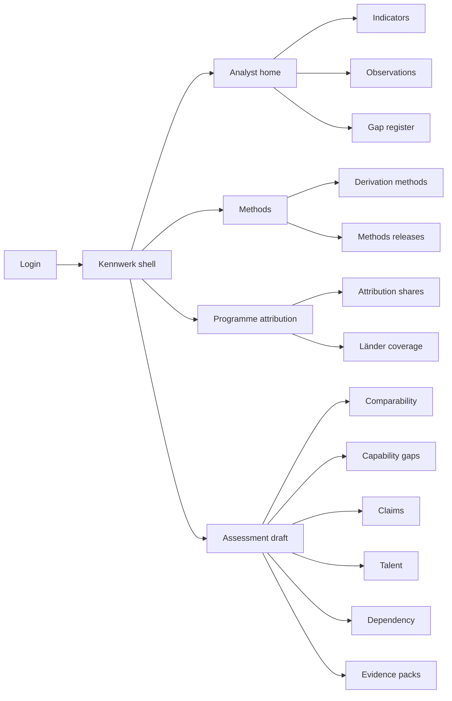
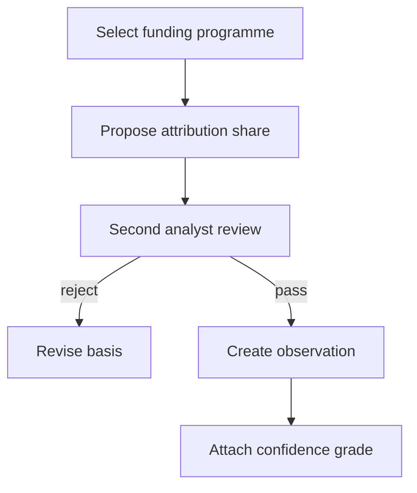
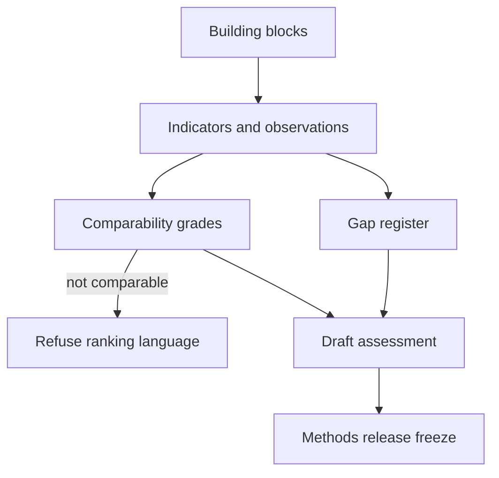

# Kennwerk — Web app

**Product:** [PRODUCT.md](./PRODUCT.md)
**Primary surface:** National AI capability measurement workbench (analyst, methodologist, programme-officer, and commission-drafter workspaces under one Kennwerk shell)
**Secondary surfaces:** Annual assessment report preview (methods-frozen); parliamentary evidence-pack export (traceable)
**Design thesis:** Kennwerk is a measurement workbench that treats “we cannot yet measure this” as a first-class output — not a blank cell to fill with false precision. The metaphor is a lab notebook for public money and ecosystem gaps: every figure shows derivation method, attribution share, and confidence grade; reconstructions from programmes that never say “AI” carry dual review; league tables are refused when comparability is only indicative. Visual language is archival paper-white on slate ink with method-amber for estimates and confidence-green only for direct measurement — Bauhaus-clear, not purple AI scoreboards. The Kennwerk wordmark sits as a quiet mint on every published figure and evidence pack.

## UX research synthesis

### Category peers (best-in-class)

- **OECD STI Scoreboard / Going Digital toolkit:** Indicator metadata, caveats, and cross-country notes. Steal: method notes beside figures; reject silent ranking when definitions diverge.
- **Our World in Data / Gapminder (epistemic UX):** Confidence and source transparency as product chrome. Steal: show the work; reject gamified “country medals” for non-comparable series.
- **UK Office for Statistics Regulation / GSS quality frameworks:** Graded quality and restatement discipline. Steal: frozen releases + explicit restatements; reject overwriting history.
- **Commission of Experts for Research and Innovation (EFI) report production (process peer):** Statutory annual evidence duty. Steal: inquiry-ready packs; reject bespoke spreadsheets per parliamentary question.

### Patterns to adopt / reject

- **Adopt:** Derivation + confidence on every published observation; dual-reviewed attribution shares; indicator gap register with owners; leading/lagging with lag horizons; comparability grades that block league language; costed gaps vs named comparators; association vs causal claims; talent cell-size suppression; compute dependency class; Länder coverage honesty; methods freezes and restatements; evidence packs for inquiries.
- **Reject:** Single ai-spend number without method; silent redefinition; ranking on indicative comps; filling gaps with vanity proxies; purple “ecosystem health” gauges; dashboard that hides “not measurable.”

### Trust, density, and workflow constraints from PRODUCT.md

Outputs are political evidence — hostile readers must reproduce methods (BR-1, BR-11, BR-12). Attribution judgements are politically explosive pre-publication (disclosure states). Talent data aggregated with cell-size suppression (BR-8). Federal-state competence requires coverage maps (BR-10). Honest year-one answer is often “no indicator” (BR-4).

## Information architecture

### Nav model

### Roles → default home

| Role | Default home | Why |
|------|--------------|-----|
| Research-policy analyst | Analyst home — open reconstructions | Hardest number: AI spend reconstruction (BR-2) |
| Methodologist / statistician | Methods releases | Freeze and restate (BR-1, BR-11) |
| Programme officer | Attribution shares | Classification judgements (BR-2) |
| Commission drafter | Assessment draft | Annual report with gaps honest (BR-3, BR-4) |
| Peer reviewer | Observation detail (read + comment) | Reproduce published numbers |
| Parliamentary liaison | Evidence packs | Traceable answers (BR-12) |

### Cross-links to OpenAPI resources

| Nav area | OpenAPI tags / resources |
|----------|---------------------------|
| Building blocks / indicators / versions | Indicators |
| Observations / confidence | Observations |
| Funding programmes / attribution / reviews | Attribution |
| Comparators / comparability / ranking attempts | Comparability |
| Indicator gap register | Gaps |
| Attribution vs association claims | Claims |
| Talent movements / returnees | Talent |
| Dependency exposures | Dependency |
| Jurisdiction coverage | Coverage |
| Methods releases / restatements / evidence packs / reports | Publication |

## Screen inventory

### Analyst home

- **Purpose:** Answer “which figures are draft, which lack dual review, and which building blocks have no leading indicator?”
- **Entry:** Analyst default.
- **Layout regions:** Brand; building-block health (incl. empty leading indicators); reconstruction queue; gap-register count; restatement alerts.
- **Primary actions:** Open observation; start attribution; open gap entry.
- **Empty / loading / error:** Empty = seed seven building blocks from strategy outline.
- **BR / story ties:** BR-3, BR-4.

### Indicator catalogue

- **Purpose:** Assign indicators to building blocks; type leading/lagging with lag years.
- **Entry:** Indicators nav.
- **Layout regions:** Block tree; indicator table; lag horizon; version history.
- **Primary actions:** Create indicator; set lag; deprecate with reason.
- **Empty / loading / error:** Block with no leading indicator = amber accountable empty.
- **BR / story ties:** BR-3.

### Observation editor

- **Purpose:** Publish-ready observation with derivation method and confidence grade always visible.
- **Entry:** From indicator; analyst queue.
- **Layout regions:** Figure; method selector; confidence grade; disclosure state; dependent-figure graph; publish preview showing method+grade beside number.
- **Primary actions:** Save; submit for review; freeze into methods release.
- **Empty / loading / error:** Missing method/confidence blocks publish.
- **BR / story ties:** BR-1.

### Attribution share workbench

- **Purpose:** Reconstruct AI spend from non-AI programmes; record share basis; second analyst review; versioned recomputation.
- **Entry:** Programme home; wedge default for year-one.
- **Layout regions:** Programme list (incl. topics without “AI” keywords); share %; basis rationale; second-review stamp; cost assumptions / headcount conversion; dependent observations.
- **Primary actions:** Propose share; second-review; revise (triggers recompute + restatement).
- **Empty / loading / error:** Unreviewed share cannot enter published assessment.
- **BR / story ties:** BR-2; €27M/year reconstruction spirit.

### Indicator gap register

- **Purpose:** Named “not yet measurable” entries with owner and development route.
- **Entry:** Analyst home; assessment draft.
- **Layout regions:** Gap list; owner; proposed route; discharge criteria.
- **Primary actions:** Open gap; assign owner; discharge when indicator exists.
- **Empty / loading / error:** Empty gaps with weak proxies warning if proxies detected.
- **BR / story ties:** BR-4.

### Comparability and ranking guard

- **Purpose:** Grade cross-country comps; refuse league-table language below comparable.
- **Entry:** Draft home; comparison attempts.
- **Layout regions:** Comparator jurisdictions; assessment grade; ranking-attempt log (refusals recorded).
- **Primary actions:** Assess comparability; attempt rank (system refuse if not comparable); cite indicative carefully.
- **Empty / loading / error:** Ranking attempt on indicative = recorded refusal UI.
- **BR / story ties:** BR-5.

### Capability gap and closure cost

- **Purpose:** Distance to named comparator on named indicator; costed closure from unit benchmark.
- **Entry:** From comparable assessment.
- **Layout regions:** Gap statement (how far / whom / price); unit benchmark (e.g. ELLIS/MPI-scale); closure estimate.
- **Primary actions:** Create gap; attach benchmark; export for speech with caveats.
- **Empty / loading / error:** Gap without named comparator blocked.
- **BR / story ties:** BR-6.

### Claims (causal vs association)

- **Purpose:** Policy outcome claims require counterfactual basis or publish as association only.
- **Entry:** Draft home.
- **Layout regions:** Claim list; counterfactual field; annual counts attributed vs not.
- **Primary actions:** Classify claim; require counterfactual; include in report stats.
- **Empty / loading / error:** Causal without basis = force association.
- **BR / story ties:** BR-7.

### Talent movements

- **Purpose:** Aggregate inbound/outbound senior moves; cell-size suppression; returnee rates separate.
- **Entry:** Talent nav.
- **Layout regions:** Flow matrix (suppressed cells); returnee programme panel; disclosure warnings.
- **Primary actions:** Import aggregates; publish with suppression; export.
- **Empty / loading / error:** Below cell size = suppressed placeholder, not fake zero.
- **BR / story ties:** BR-8.

### Strategic dependency

- **Purpose:** Compute/hardware dependency by supplier jurisdiction and export-control exposure.
- **Entry:** Dependency nav; standing beside capability indicators.
- **Layout regions:** Exposure table; jurisdiction breakdown; control-risk notes.
- **Primary actions:** Update exposure; include in assessment.
- **Empty / loading / error:** Empty = gap-register prompt for dependency data.
- **BR / story ties:** BR-9.

### Länder coverage composer

- **Purpose:** National figures composable from state figures; state covered/estimated/missing.
- **Entry:** Coverage nav; education/faculty indicators.
- **Layout regions:** Map/list of states; coverage legend; composition formula.
- **Primary actions:** Mark coverage; publish with honesty banner.
- **Empty / loading / error:** Missing states listed explicitly in output.
- **BR / story ties:** BR-10.

### Methods release, restatement, evidence pack

- **Purpose:** Freeze dated methods; restate explicitly; issue inquiry packs with lineage.
- **Entry:** Publication nav; parliamentary liaison.
- **Layout regions:** Release timeline; restatement diff (size/direction/reason); evidence pack builder (who asked, what supplied, observations, method version, confidence).
- **Primary actions:** Freeze release; issue restatement; build pack; retrieve prior release.
- **Empty / loading / error:** Cite without pack = warn non-traceable.
- **BR / story ties:** BR-11, BR-12.

## Key flows

1. **Reconstruct AI research spend** — select programme → propose attribution share → second review → convert via cost assumption → observation with method+confidence; failure: unreviewed share blocked.

2. **Publish annual assessment** — indicators by block → gaps listed → lag horizons respected → comparability enforced → methods freeze.

3. **Cost a capability gap** — named comparator → distance → unit benchmark → closure estimate.

4. **Parliamentary evidence pack** — question → select observations → pack with method versions → issue.

5. **Restatement** — change attribution basis → recompute dependents → restatement record → prior release remains.

## Design system

### Tokens (CSS variables)

- `--color-ink: #1C1C1C` — text
- `--color-paper: #F7F5F0` — ground (archival, not cream-terracotta brand)
- `--color-panel: #FFFFFF`
- `--color-slate: #2F3A45` — nav
- `--color-method: #B8860B` — estimate / reconstruction
- `--color-direct: #2E6B4F` — direct measurement confidence
- `--color-refuse: #8B3A3A` — ranking refused / suppressed cell
- `--color-steel: #6A737C` — secondary
- `--color-brand: #4A5D4E` — Kennwerk quiet mint-ink
- `--font-display: "IBM Plex Serif", serif` — figure titles in reports
- `--font-body: "IBM Plex Sans", sans-serif`
- `--font-mono: "IBM Plex Mono", monospace` — method ids, versions, packs
- `--space-1`…`--space-8`: 4px scale
- `--radius-sm: 2px`; `--radius-md: 4px`
- `--motion-grade: 150ms ease-out` — confidence chip
- `--motion-refuse: 200ms ease-in-out` — ranking refusal
- `--motion-freeze: 180ms ease-out` — methods freeze stamp
- Atmosphere: ruled notebook subtle lines; footnote density welcome; no glowing ecosystem orbs.

### Typography & brand

- Serif for published figures in report preview; sans for workbench; mono for versions.
- Brand on observation publish, packs, and assessment freeze screens.
- Login: brand hero; headline (“Show the method beside the number”); one CTA.

### Do / don’t

- **Do:** Always show method + confidence; dual-review reconstructions; register gaps; refuse non-comparable ranks; cost gaps vs named comparators; suppress small talent cells.
- **Don’t:** False-precision single spend figure; silent edits; league tables on indicative data; vanity proxies for gaps; purple AI gauges.

### Accessibility & domain trust cues

- Method amber / direct green with text grades (not colour alone).
- Live regions for restatement and ranking refusal.
- Focus: indicator → observation → attribution → freeze → pack.
- Prior releases always retrievable for auditors.

## Component patterns

- **MethodConfidencePair** — derivation + grade beside every figure.
- **AttributionShareReview** — dual analyst stamps.
- **IndicatorGapEntry** — not-yet-measurable with owner.
- **LagHorizonBadge** — leading/lagging with years.
- **ComparabilityGrade** — comparable / indicative / not comparable.
- **RankingRefusalToast** — recorded refuse.
- **CapabilityGapCost** — distance + unit benchmark + closure.
- **ClaimCounterfactualField** — causal vs association.
- **SuppressedCell** — talent matrix honesty.
- **DependencyExposureTable** — jurisdiction + export control.
- **LaenderCoverageMap** — covered / estimated / missing.
- **MethodsFreezeStamp** — dated release.
- **EvidencePackBuilder** — inquiry lineage.

## Out of scope for v1 web

- Executing research grants; tracking named individual researchers; replacing Destatis; public citizen league-table game; automated web scraping as sole source without method records; ministry press CMS.
